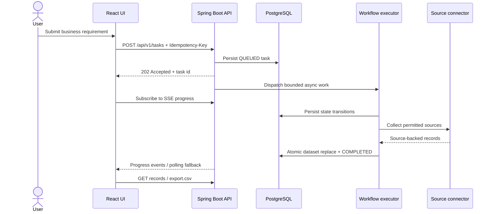

# NUMEN Architecture

## Design goals

NUMEN is designed around five constraints: traceability, safe collection, repeatability, operational visibility and zero mandatory paid-AI dependency.

## System context

```mermaid
flowchart LR
    U[User / Browser] -->|HTTP + SSE| G[Unprivileged Nginx\nReact + TypeScript]
    G -->|/api/v1/*| A[Spring Boot API]
    A --> P[(PostgreSQL)]
    A -->|validated public HTTP(S)| E[Permitted external sources]
    A --> M[Actuator / Micrometer]
    A --> W[Bounded workflow executor]
    W --> C[Source connectors]
    C --> E
```

## Runtime topology

```text
Browser
  │ :5173
  ▼
Nginx + React
  │ /api/*
  ▼
Spring Boot :8080
  │
  ├─ WorkflowPlanner
  ├─ TaskRunner
  ├─ CollectionEngine
  │    ├─ HttpPageConnector ── UrlSafetyGuard ── public HTTP(S)
  │    └─ DemoCatalogConnector
  ├─ WorkflowResultPublisher
  └─ JPA repositories
        │
        ▼
PostgreSQL
```

Docker Compose is the canonical local runtime. The browser reaches only the frontend and optionally the API loopback port. PostgreSQL stays private to the Compose network.

## Backend package responsibilities

- `connector` — source-adapter contracts and concrete collection adapters.
- `controller` — HTTP boundary, versioned routes, validation and response DTOs.
- `domain` — framework-light domain contracts shared across application boundaries.
- `dto` — stable external API contracts. JPA entities are not exposed directly.
- `service` — application use cases and workflow orchestration.
- `security` — outbound source validation and SSRF guardrails.
- `repository` — database access contracts.
- `entity` — persistence model and state transitions.
- `exception` — consistent HTTP error mapping.
- `config` — typed configuration and cross-cutting framework setup.

## Workflow request flow



## Workflow lifecycle

`QUEUED → PLANNING → COLLECTING → PROCESSING → COMPLETED`

Terminal alternatives are `FAILED` and `CANCELLED`. The entity enforces valid transitions and monotonic non-terminal progress rather than allowing arbitrary state mutation. Progress events are published through Server-Sent Events with bounded stream lifetimes and browser reconnect hints. Empty listener groups are removed and all emitters are completed during application shutdown. Optimistic locking protects concurrent workflow updates.

## Persistence

Flyway owns schema evolution. Hibernate runs with `ddl-auto=validate`, so accidental schema drift fails fast instead of mutating production tables. Dataset replacement and terminal workflow completion are committed by `WorkflowResultPublisher` in one transaction so a failed/cancelled publication cannot expose a partially replaced result set.

## Collection boundary

Only explicit absolute HTTP(S) URLs are accepted for live fetching. `CollectionEngine` chooses exactly one compatible `SourceConnector`. The HTTP connector resolves the target host, rejects private/local/link-local/multicast/reserved addresses, embedded credentials and non-standard ports, disables redirects and applies timeout/body-size limits. Transient network errors, HTTP 408, HTTP 429 and 5xx responses use a small bounded retry budget with exponential backoff plus jitter; permanent HTTP failures are not retried. Prompts without URLs use the explicitly labelled demo connector.

## Scaling path

The current worker pool is intentionally bounded for a single-node challenge deployment. At higher scale, replace in-process dispatch with Kafka/SQS, move raw evidence to object storage, use distributed rate limiting, persist event streams, and add per-tenant quotas.


## Restart recovery

At application readiness, workflows left in `QUEUED`, `PLANNING`, `COLLECTING` or `PROCESSING` by a previous process interruption move through an explicit recovery transition and are redispatched through the normal bounded executor. Publication remains atomic, so a recovered workflow cannot expose a partially replaced dataset. If admission capacity is exhausted, recovery failure is persisted visibly instead of leaving the task indefinitely stuck.
